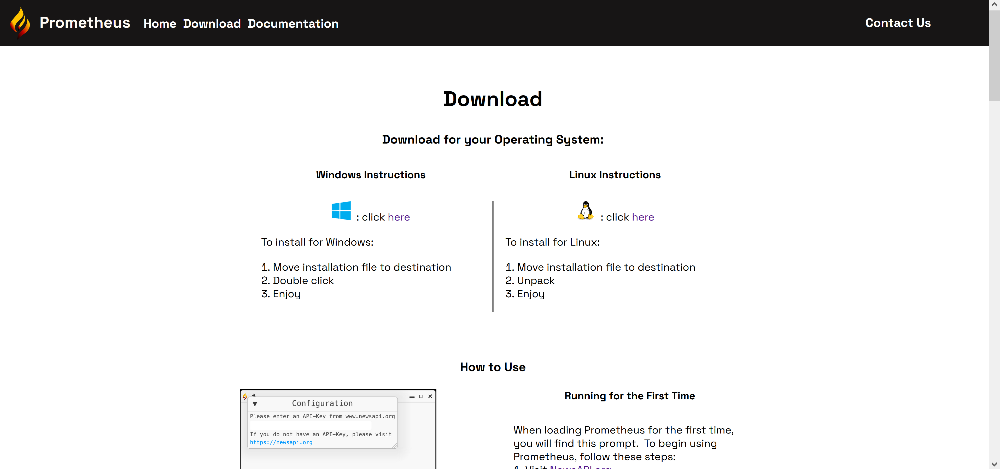
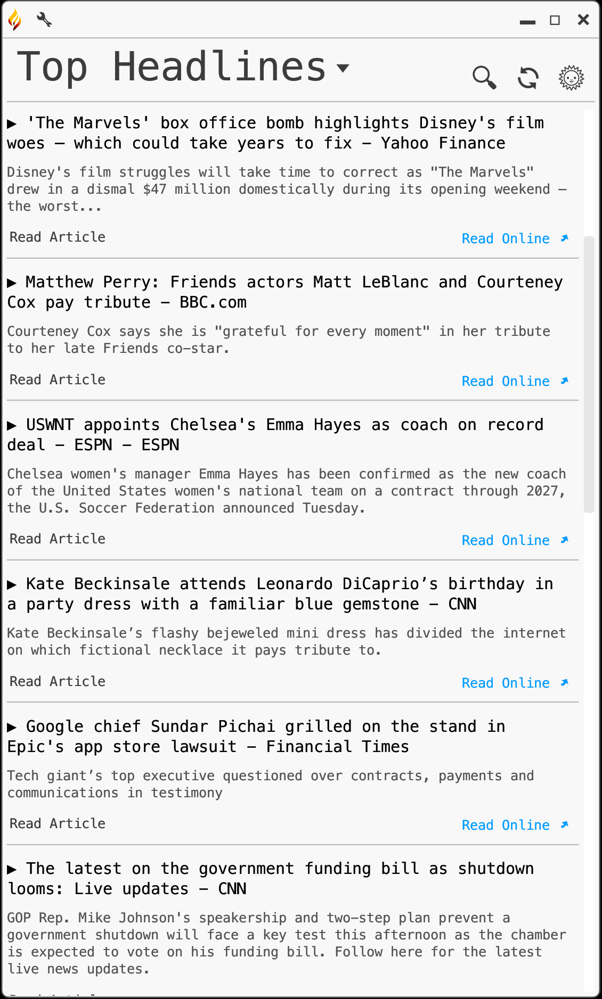
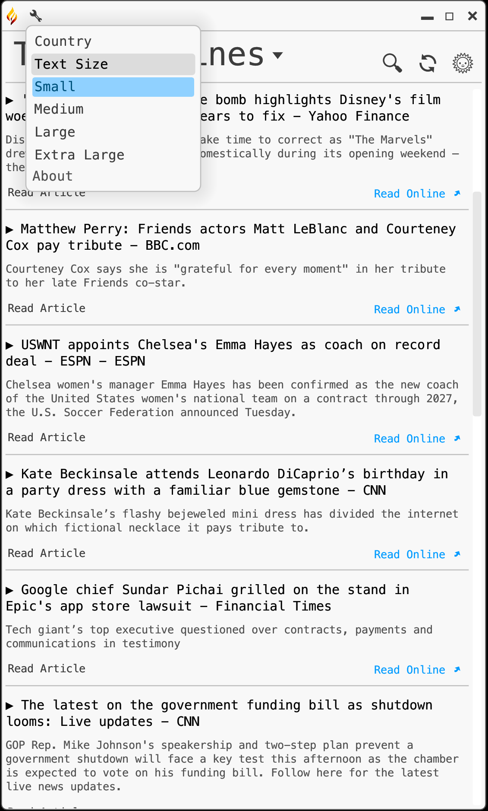
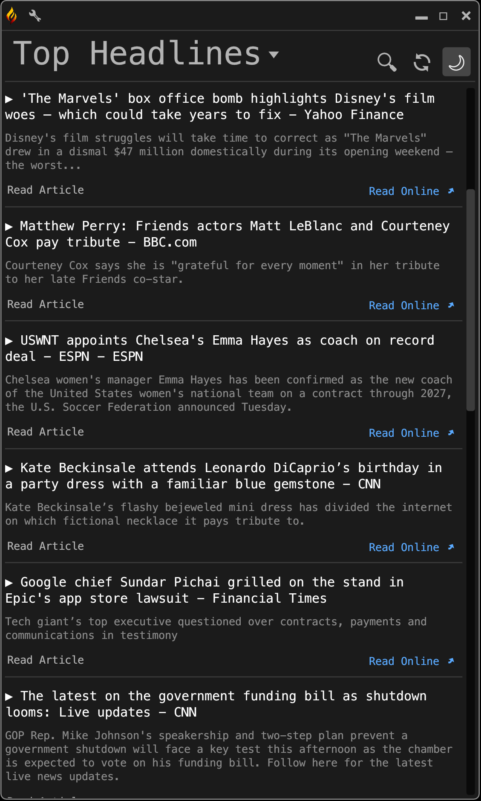

#  Prometheus


---
Student: Ricardo Harris

Degree: Bachelor of Science in Computer Science

Project Advisor: Dr. Sean Hayes

Expected Graduation: December 2023

---

<table>
	<thead>
		<tr>
			<th align="left">
				Table of Contents:
			</th>
		</tr>
	</thead>
	<tbody>
		<tr>
			<td>
				1. <a href="#state">Problem Statement</a></br>
				2. <a href="#desc">Project Description</a></br>
				3. <a href="#lang">Proposed Implementation Language(s)</a></br>
				4. <a href="#lib">Libraries, Packages, and Development Kits</a></br>
				5. <a href="#add">Additional Software/Equipment Needed</a></br>
				6. <a href="#motive">Personal Motivation</a></br>
				7. <a href="#future">Future Research Efforts</a></br>
				8. <a href="#sched">Schedule</a></br>
				9. <a href="#reqs">Requirements</a><br />
				10. <a href="#impl">Implementation</a><br />
				11. <a href="#plan">Test Plan</a><br />
				12. <a href="#cases">Test Cases</a><br />
				13. <a href="#script">Useability Testing Script</a><br />
				14. <a href="#results">Test Results</a><br />
				15. <a href="#challenges">Challenges Overcome</a><br />
				16. <a href="#enhancements">Future Enhancements</a><br />
			</td>
		</tr>
	</tbody>
</table>

---
## Problem Statement <a id="state"></a>
<p>
	&nbsp;&nbsp;&nbsp;&nbsp;&nbsp;When Andrew Grove, former CEO of Intel, stepped down from his position as chairman in 2005, he gave a word of warning to the computer industry:
<br><br>
	&nbsp;&nbsp;&nbsp;&nbsp;&nbsp;"Privacy is one of the biggest problems in this new electronic age. At the heart of the Internet culture is a force that wants to find out everything about you. And once it has found out everything about you and two hundred million others, that's a very valuable asset, and people will be tempted to trade and do commerce with that asset. This wasn't the information that people were thinking of when they called this the information age."
	<br><p align="right">-Andrew Grove</p>
In the time since, we have seen sweeping advances in the collection and sale of personal data throughout the internet, to the worry of many. According to Pew Research, 80% of Americans are concerned about the collection and use of personal data for profit, viewing it as a net negative on society. Yet the same percentage feel that they have little to no control over their own personal data on the internet. This problem has been exacerbated by the amount we rely on the internet for basic services such as the free press, which is integral to a free and fair democracy. Again, per Pew Research, 86% of Americans get some form of news through the internet, with half of those that use social media getting the majority of their news from those platforms. This is problematic because, given the short-form nature of social media posts, news access through social media platforms is non-existent. Instead, news is disseminated across these platforms in the form of hyperbolic, inflammatory headlines to grab attention, followed by links to the source material. Yet even when Americans are interested in the headlines shown across their feeds, only 41% of Americans will click on those links to read the associated articles. When surveyed, the number one reason users don't follow through is not wanting to navigate to a different site, partly out of concerns for furthering the spread of their personal data through site-tracking cookies. This reluctance to navigate the broader internet due to privacy concerns, coupled with the dominant method of spreading news across social media, has resulted in a measurable decrease in media literacy; Pew Research shows that users who only get their news from social media are 32% less knowledgeable on current events. This growing lack of media literacy has immesurably harmed the fabric of American society. My thesis is that one way we can increase media literacy is by aggregating news into a single platform focused on readability, and that by doing so in a way that does not collect or share personal data, we can attract a userbase as an alternative to both news sites and social media.
</p>

---
## Project Description <a id="desc"></a>
<p>
	&nbsp;&nbsp;&nbsp;&nbsp;&nbsp;Prometheus is a rust-based newsreader application that displays both aggregate news data and articles as requested by users through default or customizeable searches. Searches are executed through the newsapi.org platform, ensuring articles are curated from verifiable media sources in a way that does not share any personal data. Prometheus will have a setting for country and a setting for category, both of which default to United States and Top Stories respectively. Furthermore, there will be a search text box and button. Articles will be listed with headlines and descriptions, along with a button to load the article for reading if available, as well as a hyperlink to the article for more content. Prometheus will have night-mode support and a font size menu to aid in readability. Lastly, there will be a website for downloading Prometheus and a markdown user guide. As a rust-based distribution, executables will be available for Windows and Linux operating systems.
</p>

---
## Proposed Implementation Languages <a id="lang"></a>
* Rust
* Javascript
* HTML

---
## Libraries, Packages, and Development Kits <a id="lib"></a>
* Rustup
* React.js

---
## Additional Software/Equipment Needed <a id="add"></a>
* Laptop/PC

---
## Personal Motivation <a id="motive"></a>
<p>
	&nbsp;&nbsp;&nbsp;&nbsp;&nbsp;Modern lack of media literacy, and the resulting fertile ground for misinformation, has impacted me deeply. I have lost family and friends both directly and indirectly because of their lack of media literacy. I do not mean that I have just lost relationships; people I held dear have lost their lives due to Covid misinformation alone. I hold no auspices that Prometheus will fix media literacy, but for those I have lost, and those I still have, it is important that I do what I can.
</p>

---
## Future Research Efforts <a id="future"></a>
* Rust
* GUI Development
* MERN Stack Web Development

---
## Schedule <a id="sched"></a>
<table>
	<thead>
		<tr>
			<th>
				Task
			</th>
			<th>
				Requirements
			</th>
			<th>
				Date
			</th>
		</tr>
	</thead>
	<tbody>
		<tr>
			<td>
				Project Proposal
			</td>
			<td>
				<a href="#req1">1</a>
			</td>
			<td>
				October 5, 2023
			</td>
		</tr>
		<tr>
			<td>
				Project Requirements
			</td>
			<td>
				<a href="#req2">2</a>
			</td>
			<td>
				October 5, 2023
			</td>
		</tr>
		<tr>
			<td>
				Prototype Newsreader Restful API
			</td>
			<td>
				<a href="#req3">3</a>,
				<a href="#req4">4</a>,
				<a href="#req5">5</a>,
				<a href="#req6">6</a>,
				<a href="#req7">7</a>
			</td>
			<td>
				October 5, 2023
			</td>
		</tr>
		<tr>
			<td>
				Prototype GUI
			</td>
			<td>
				<a href="#req8">8</a>,
				<a href="#req9">9</a>,
				<a href="#req10">10</a>,
				<a href="#req11">11</a>,
				<a href="#req12">12</a>
			</td>
			<td>
				October 5, 2023
			</td>
		</tr>
		<tr>
			<td>
				Test Plan - Rough Draft
			</td>
			<td>
				<a href="#req13">13</a>
			</td>
			<td>
				October 5, 2023
			</td>
		</tr>
		<tr>
			<td>
				Complete Newsreader Restful API
			</td>
			<td>
				<a href="#req14">14</a>
			</td>
			<td>
				October 12, 2023
			</td>
		</tr>
		<tr>
			<td>
				Prototype Menu GUI
			</td>
			<td>
				<a href="#req14">14</a>,
				<a href="#req15">15</a>,
				<a href="#req16">16</a>,
				<a href="#req17">17</a>,
				<a href="#req18">18</a>,
				<a href="#req19">19</a>,
				<a href="#req20">20</a>,
				<a href="#req21">21</a>,
				<a href="#req22">22</a>
			</td>
			<td>
				October 12, 2023
			</td>
		</tr>
		<tr>
			<td>
				Completed GUI</br>
				<b><i><u>(MINIMUM VIABLE PRODUCT)</u></i></b>
			</td>
			<td>
				<a href="#req23">23</a>,
				<a href="#req24">24</a>,
				<a href="#req25">25</a>
			</td>
			<td>
				October 19, 2023
			</td>
		</tr>
		<tr>
			<td>
				Prototype Website
			</td>
			<td>
				<a href="#req26">26</a>,
				<a href="#req27">27</a>
			</td>
			<td>
				October 19, 2023
			</td>
		</tr>
		<tr>
			<td>
				Finalize Website
			</td>
			<td>
				<a href="#req28">28</a>
			</td>
			<td>
				October 26, 2023
			</td>
		</tr>
		<tr>
			<td>
				Complete Test Plan
			</td>
			<td>
				<a href="#req29">29</a>
			</td>
			<td>
				October 26, 2023
			</td>
		</tr>
		<tr>
			<td>
				Begin Testing
			</td>
			<td>
				<a href="#req30">30</a>
			</td>
			<td>
				October 26, 2023
			</td>
		</tr>
		<tr>
			<td>
				Gather Documentation
			</td>
			<td>
				<a href="#req31">31</a>
			</td>
			<td>
				October 26, 2023
			</td>
		</tr>
		<tr>
			<td>
				Finalize Testing
			</td>
			<td>
				<a href="#req32">32</a>
			</td>
			<td>
				November 9, 2023
			</td>
		</tr>
		<tr>
			<td>
				Finalize Documentation
			</td>
			<td>
				<a href="#req33">33</a>
			</td>
			<td>
				November 23, 2023
			</td>
		</tr>
		<tr>
			<td>
				Finalize Project
			</td>
			<td>
				<a href="#req34">34</a>
			</td>
			<td>
				November 27, 2023
			</td>
		</tr>
		<tr>
			<td>
				Present Project
			</td>
			<td>
				<a href="#req35">35</a>
			</td>
			<td>
				December 1, 2023
			</td>
		</tr>
	</tbody>
</table>


---
## Requirements <a id="reqs"></a>

<a id="req1"></a>
<table>
	<thead>
		<tr>
			<th>
				Requirement #:
			</th>
			<td>
				&nbsp;1&nbsp;
			</td>
			<th>
				Requirement Type:
			</th>
			<td style="width:200px">
				Documentation
			</td>
			<th>
				Event/BUC/PUC #
			</th>
			<td>
				&nbsp;&nbsp;
			</td>
		</tr>
	</thead>
	<tbody>
		<tr>
			<td>
				Description:
			</td>
			<td colspan=5>
				Finalize Project Proposal
			</td>
		</tr>
		<tr>
			<td>
				Rationale:
			</td>
			<td colspan=5>
				To have documentation to manage creation of Prometheus.
			</td>
		</tr>
		<tr>
			<td>
				Fit Criterion:
			</td>
			<td colspan=5>
				A completed project proposal.
			</td>
		</tr>
		<tr>
			<td>
				Priority:
			</td>
			<td>
				<a href="#prio4">4</a>
			</td>
			<td>
				Dependencies:
			</td>
			<td>
			</td>
			<td>
				Conflicts:
			</td>
			<td>
			</td>
		</tr>
		<tr>
			<td>
				Supporting Materials:
			</td>
			<td colspan=5>
				<a href="https://github.com/csu-cs/CSU-Senior-Project/blob/master/references/Syllabus_497_Senior_Project_Design.md">
					Project Proposal Syllabus
				</a>
			</td>
		</tr>
		<tr>
			<td>
				History:
			</td>
			<td colspan=5>
				4/6/2023: Created</br>
				10/4/2023: Rebuilt to assess new project goals</br>
				10/5/2023: Completed
			</td>
		</tr>
		<tr>
			<td colspan=6 border=none>
				</br>
			</td>
		</tr>
	</tbody>
	<a id="req2"></a>
	<thead>
		<tr>
			<th>
				Requirement #:
			</th>
			<td>
				&nbsp;2&nbsp;
			</td>
			<th>
				Requirement Type:
			</th>
			<td style="width:200px">
				Documentation
			</td>
			<th>
				Event/BUC/PUC #
			</th>
			<td>
				&nbsp;&nbsp;
			</td>
		</tr>
	</thead>
	<tbody>
		<tr>
			<td>
				Description:
			</td>
			<td colspan=5>
				Finalize Project Requirements
			</td>
		</tr>
		<tr>
			<td>
				Rationale:
			</td>
			<td colspan=5>
				To have documentation to manage the creation of Prometheus.
			</td>
		</tr>
		<tr>
			<td>
				Fit Criterion:
			</td>
			<td colspan=5>
				A completed list of Volere Project Requirements.
			</td>
		</tr>
		<tr>
			<td>
				Priority:
			</td>
			<td>
				<a href="#prio4">4</a>
			</td>
			<td>
				Dependencies:
			</td>
			<td>
			</td>
			<td>
				Conflicts:
			</td>
			<td>
			</td>
		</tr>
		<tr>
			<td>
				Supporting Materials:
			</td>
			<td colspan=5>
				<a href="https://github.com/csu-cs/CSU-Senior-Project/blob/master/references/Syllabus_497_Senior_Project_Design.md">
					Project Proposal Syllabus
				</a>,</br>
				<a href="https://www.volere.org/templates/volere-requirements-specification-template/">
					Volere Requirements Specification Template
				</a></br>
			</td>
		</tr>
		<tr>
			<td>
				History:
			</td>
			<td colspan=5>
				10/5/2023: Created</br>
				10/5/2023: Completed
			</td>
		</tr>
		<tr>
			<td colspan=6>
				</br>
			</td>
		</tr>
	</tbody>
	<a id="req3"></a>
	<thead>
		<tr>
			<th>
				Requirement #:
			</th>
			<td>
				&nbsp;3&nbsp;
			</td>
			<th>
				Requirement Type:
			</th>
			<td style="width:200px">
				Functionality
			</td>
			<th>
				Event/BUC/PUC #
			</th>
			<td>
				<a href="#case1">1</a>
			</td>
		</tr>
	</thead>
	<tbody>
		<tr>
			<td>
				Description:
			</td>
			<td colspan=5>
				Acquire NewsAPI.org API key
			</td>
		</tr>
		<tr>
			<td>
				Rationale:
			</td>
			<td colspan=5>
				To have a valid API key to request news data.
			</td>
		</tr>
		<tr>
			<td>
				Fit Criterion:
			</td>
			<td colspan=5>
				A valid account and API key from NewsAPI.org.
			</td>
		</tr>
		<tr>
			<td>
				Priority:
			</td>
			<td>
				<a href="#prio1">1</a>
			</td>
			<td>
				Dependencies:
			</td>
			<td>
			</td>
			<td>
				Conflicts:
			</td>
			<td>
			</td>
		</tr>
		<tr>
			<td>
				Supporting Materials:
			</td>
			<td colspan=5>
				<a href="https://newsapi.org/docs/get-started">
					NewsAPI.org Beginner Guide
				</a>
			</td>
		</tr>
		<tr>
			<td>
				History:
			</td>
			<td colspan=5>
				10/5/2023: Created</br>
				10/5/2023: Completed
			</td>
		</tr>
		<tr>
			<td colspan=6>
				</br>
			</td>
		</tr>
	</tbody>
	<a id="req4"></a>
	<thead>
		<tr>
			<th>
				Requirement #:
			</th>
			<td>
				&nbsp;4&nbsp;
			</td>
			<th>
				Requirement Type:
			</th>
			<td style="width:200px">
				Functionality
			</td>
			<th>
				Event/BUC/PUC #
			</th>
			<td>
				<a href="#case1">1</a>
			</td>
		</tr>
	</thead>
	<tbody>
		<tr>
			<td>
				Description:
			</td>
			<td colspan=5>
				Request News Information
			</td>
		</tr>
		<tr>
			<td>
				Rationale:
			</td>
			<td colspan=5>
				To request news information in JSON format from NewsAPI.org.
			</td>
		</tr>
		<tr>
			<td>
				Fit Criterion:
			</td>
			<td colspan=5>
				Prometheus must successfully request JSON from NewsAPI.org.
			</td>
		</tr>
		<tr>
			<td>
				Priority:
			</td>
			<td>
				<a href="#prio1">1</a>
			</td>
			<td>
				Dependencies:
			</td>
			<td>
				<a href="#req3">3</a>
			</td>
			<td>
				Conflicts:
			</td>
			<td>
			</td>
		</tr>
		<tr>
			<td>
				Supporting Materials:
			</td>
			<td colspan=5>
				<a href="https://docs.rs/url/latest/url/">
					Rust URL Crate Documentation
				</a>
			</td>
		</tr>
		<tr>
			<td>
				History:
			</td>
			<td colspan=5>
				10/5/2023: Created</br>
				10/5/2023: Completed
			</td>
		</tr>
		<tr>
			<td colspan=6>
				</br>
			</td>
		</tr>
	</tbody>
	<a id="req5"></a>
	<thead>
		<tr>
			<th>
				Requirement #:
			</th>
			<td>
				&nbsp;5&nbsp;
			</td>
			<th>
				Requirement Type:
			</th>
			<td style="width:200px">
				Functionality
			</td>
			<th>
				Event/BUC/PUC #
			</th>
			<td>
				<a href="#case1">1</a>
			</td>
		</tr>
	</thead>
	<tbody>
		<tr>
			<td>
				Description:
			</td>
			<td colspan=5>
				Parse JSON
			</td>
		</tr>
		<tr>
			<td>
				Rationale:
			</td>
			<td colspan=5>
				To be able to interpret JSON data as Rust variables
			</td>
		</tr>
		<tr>
			<td>
				Fit Criterion:
			</td>
			<td colspan=5>
				Prometheus must successfully parse recieved JSON data into internal</br>
				variables.
			</td>
		</tr>
		<tr>
			<td>
				Priority:
			</td>
			<td>
				<a href="#prio1">1</a>
			</td>
			<td>
				Dependencies:
			</td>
			<td>
				<a href="#req3">3</a>,
				<a href="#req4">4</a>
			</td>
			<td>
				Conflicts:
			</td>
			<td>
				<a href="#req6">6</a>
			</td>
		</tr>
		<tr>
			<td>
				Supporting Materials:
			</td>
			<td colspan=5>
				<a href="https://docs.rs/serde_json/latest/serde_json/">
					Rust Serde_JSON Crate Documentation
				</a>,</br>
				<a href="https://docs.rs/serde/latest/serde/index.html/">
					Rust Serde Crate Documentation
				</a>
			</td>
		</tr>
		<tr>
			<td>
				History:
			</td>
			<td colspan=5>
				10/5/2023: Created</br>
				10/5/2023: Completed
			</td>
		</tr>
		<tr>
			<td colspan=6>
				</br>
			</td>
		</tr>
	</tbody>
	<a id="req6"></a>
	<thead>
		<tr>
			<th>
				Requirement #:
			</th>
			<td>
				&nbsp;6&nbsp;
			</td>
			<th>
				Requirement Type:
			</th>
			<td style="width:200px">
				Functionality
			</td>
			<th>
				Event/BUC/PUC #
			</th>
			<td>
				<a href="#case1">1</a>
			</td>
		</tr>
	</thead>
	<tbody>
		<tr>
			<td>
				Description:
			</td>
			<td colspan=5>
				Handle NewsAPI Errors
			</td>
		</tr>
		<tr>
			<td>
				Rationale:
			</td>
			<td colspan=5>
				To have error handling that does not crash Prometheus.
			</td>
		</tr>
		<tr>
			<td>
				Fit Criterion:
			</td>
			<td colspan=5>
				Prometheus must handle errors from NewsAPI.org without crashing.
			</td>
		</tr>
		<tr>
			<td>
				Priority:
			</td>
			<td>
				<a href="#prio1">1</a>
			</td>
			<td>
				Dependencies:
			</td>
			<td>
				<a href="#req3">3</a>,
				<a href="#req4">4</a>
			</td>
			<td>
				Conflicts:
			</td>
			<td>
				<a href="#req5">5</a>
			</td>
		</tr>
		<tr>
			<td>
				Supporting Materials:
			</td>
			<td colspan=5>
				<a href="https://docs.rs/serde_json/latest/serde_json/">
					Rust Serde_JSON Crate Documentation
				</a>,</br>
				<a href="https://docs.rs/serde/latest/serde/index.html/">
					Rust Serde Crate Documentation
				</a>
			</td>
		</tr>
		<tr>
			<td>
				History:
			</td>
			<td colspan=5>
				10/5/2023: Created</br>
				11/13/2023: Completed
			</td>
		</tr>
		<tr>
			<td colspan=6>
				</br>
			</td>
		</tr>
	</tbody>
	<a id="req7"></a>
	<thead>
		<tr>
			<th>
				Requirement #:
			</th>
			<td>
				&nbsp;7&nbsp;
			</td>
			<th>
				Requirement Type:
			</th>
			<td style="width:200px">
				Functionality
			</td>
			<th>
				Event/BUC/PUC #
			</th>
			<td>
				<a href="#case1">1</a>
			</td>
		</tr>
	</thead>
	<tbody>
		<tr>
			<td>
				Description:
			</td>
			<td colspan=5>
				Mutate Variables
			</td>
		</tr>
		<tr>
			<td>
				Rationale:
			</td>
			<td colspan=5>
				To mutate variables for readability by the user.
			</td>
		</tr>
		<tr>
			<td>
				Fit Criterion:
			</td>
			<td colspan=5>
				Prometheus must convert date format to local, and remove superfluous<br />
				status text from Title, Description, and Article contents.
			</td>
		</tr>
		<tr>
			<td>
				Priority:
			</td>
			<td>
				<a href="#prio1">1</a>
			</td>
			<td>
				Dependencies:
			</td>
			<td>
				<a href="#req3">3</a>,
				<a href="#req4">4</a>
			</td>
			<td>
				Conflicts:
			</td>
			<td>
				<a href="#req5">5</a>
			</td>
		</tr>
		<tr>
			<td>
				Supporting Materials:
			</td>
			<td colspan=5>
				<a href="https://docs.rs/serde_json/latest/serde_json/">
					Rust Serde_JSON Crate Documentation
				</a>,</br>
				<a href="https://docs.rs/serde/latest/serde/index.html/">
					Rust Serde Crate Documentation
				</a>
			</td>
		</tr>
		<tr>
			<td>
				History:
			</td>
			<td colspan=5>
				10/5/2023: Created</br>
				11/13/2023: Completed
			</td>
		</tr>
		<tr>
			<td colspan=6>
				</br>
			</td>
		</tr>
	</tbody>
	<a id="req8"></a>
	<thead>
		<tr>
			<th>
				Requirement #:
			</th>
			<td>
				&nbsp;8&nbsp;
			</td>
			<th>
				Requirement Type:
			</th>
			<td style="width:200px">
				Display/Functionality
			</td>
			<th>
				Event/BUC/PUC #
			</th>
			<td>
				<a href="#case1">1</a>
			</td>
		</tr>
	</thead>
	<tbody>
		<tr>
			<td>
				Description:
			</td>
			<td colspan=5>
				Display Prometheus NewsAPI Results in Frame
			</td>
		</tr>
		<tr>
			<td>
				Rationale:
			</td>
			<td colspan=5>
				To have a frame display articles or errors.
			</td>
		</tr>
		<tr>
			<td>
				Fit Criterion:
			</td>
			<td colspan=5>
				The Prometheus GUI must display results from NewsAPI requests.
			</td>
		</tr>
		<tr>
			<td>
				Priority:
			</td>
			<td>
				<a href="#prio1">1</a>
			</td>
			<td>
				Dependencies:
			</td>
			<td>
				<a href="#req5">5</a>,
				<a href="#req6">6</a>
			</td>
			<td>
				Conflicts:
			</td>
			<td>
			</td>
		</tr>
		<tr>
			<td>
				Supporting Materials:
			</td>
			<td colspan=5>
				<a href="https://docs.rs/eframe/latest/eframe/">
					Rust EFrame Crate Documentation
				</a>,</br>
				<a href="https://docs.rs/eframe/latest/egui/">
					Rust EGUI Crate Documentation
				</a>
			</td>
		</tr>
		<tr>
			<td>
				History:
			</td>
			<td colspan=5>
				10/5/2023: Created</br>
				10/5/2023: Completed
			</td>
		</tr>
		<tr>
			<td colspan=6>
				</br>
			</td>
		</tr>
	</tbody>
	<a id="req9"></a>
	<thead>
		<tr>
			<th>
				Requirement #:
			</th>
			<td>
				&nbsp;9&nbsp;
			</td>
			<th>
				Requirement Type:
			</th>
			<td style="width:200px">
				Display
			</td>
			<th>
				Event/BUC/PUC #
			</th>
			<td>
				<a href="#case1">1</a>
			</td>
		</tr>
	</thead>
	<tbody>
		<tr>
			<td>
				Description:
			</td>
			<td colspan=5>
				Display Title and Description
			</td>
		</tr>
		<tr>
			<td>
				Rationale:
			</td>
			<td colspan=5>
				To display all resulting articles in Title and Description format.
			</td>
		</tr>
		<tr>
			<td>
				Fit Criterion:
			</td>
			<td colspan=5>
				The Prometheus GUI must display all Article objects as Titles</br>
				and Descriptions.
			</td>
		</tr>
		<tr>
			<td>
				Priority:
			</td>
			<td>
				<a href="#prio2">2</a>
			</td>
			<td>
				Dependencies:
			</td>
			<td>
				<a href="#req5">5</a>,
				<a href="#req8">8</a>
			</td>
			<td>
				Conflicts:
			</td>
			<td>
			</td>
		</tr>
		<tr>
			<td>
				Supporting Materials:
			</td>
			<td colspan=5>
				<a href="https://docs.rs/eframe/latest/egui/">
					Rust EGUI Crate Documentation
				</a>
			</td>
		</tr>
		<tr>
			<td>
				History:
			</td>
			<td colspan=5>
				10/5/2023: Created</br>
				10/5/2023: Completed
			</td>
		</tr>
		<tr>
			<td colspan=6>
				</br>
			</td>
		</tr>
	</tbody>
	<a id="req10"></a>
	<thead>
		<tr>
			<th>
				Requirement #:
			</th>
			<td>
				10
			</td>
			<th>
				Requirement Type:
			</th>
			<td style="width:200px">
				Display
			</td>
			<th>
				Event/BUC/PUC #
			</th>
			<td>
				<a href="#case1">1</a>
			</td>
		</tr>
	</thead>
	<tbody>
		<tr>
			<td>
				Description:
			</td>
			<td colspan=5>
				Display Article Contents
			</td>
		</tr>
		<tr>
			<td>
				Rationale:
			</td>
			<td colspan=5>
				To be able to view full articles.
			</td>
		</tr>
		<tr>
			<td>
				Fit Criterion:
			</td>
			<td colspan=5>
				The Prometheus GUI must have functional buttons to switch</br>
				focus to and from Article objects to display their contents.
			</td>
		</tr>
		<tr>
			<td>
				Priority:
			</td>
			<td>
				<a href="#prio2">2</a>
			</td>
			<td>
				Dependencies:
			</td>
			<td>
				<a href="#req5">5</a>,
				<a href="#req8">8</a>
			</td>
			<td>
				Conflicts:
			</td>
			<td>
			</td>
		</tr>
		<tr>
			<td>
				Supporting Materials:
			</td>
			<td colspan=5>
				<a href="https://docs.rs/eframe/latest/egui/">
					Rust EGUI Crate Documentation
				</a>
			</td>
		</tr>
		<tr>
			<td>
				History:
			</td>
			<td colspan=5>
				10/5/2023: Created</br>
				10/6/2023: In Progress</br>
				11/13/2023: Completed
			</td>
		</tr>
		<tr>
			<td colspan=6>
				</br>
			</td>
		</tr>
	</tbody>
	<a id="req11"></a>
	<thead>
		<tr>
			<th>
				Requirement #:
			</th>
			<td>
				11
			</td>
			<th>
				Requirement Type:
			</th>
			<td style="width:200px">
				Display/Functionality
			</td>
			<th>
				Event/BUC/PUC #
			</th>
			<td>
				<a href="#case1">1</a>
			</td>
		</tr>
	</thead>
	<tbody>
		<tr>
			<td>
				Description:
			</td>
			<td colspan=5>
				Link to Article
			</td>
		</tr>
		<tr>
			<td>
				Rationale:
			</td>
			<td colspan=5>
				To be able to access article content not provided by NewsAPI.org
			</td>
		</tr>
		<tr>
			<td>
				Fit Criterion:
			</td>
			<td colspan=5>
				Prometheus should display a functional link that opens the</br>
				source website in the system's default browser.
			</td>
		</tr>
		<tr>
			<td>
				Priority:
			</td>
			<td>
				<a href="#prio2">2</a>
			</td>
			<td>
				Dependencies:
			</td>
			<td>
				<a href="#req5">5</a>,
				<a href="#req8">8</a>
			</td>
			<td>
				Conflicts:
			</td>
			<td>
			</td>
		</tr>
		<tr>
			<td>
				Supporting Materials:
			</td>
			<td colspan=5>
				<a href="https://docs.rs/eframe/latest/egui/">
					Rust EGUI Crate Documentation
				</a>
			</td>
		</tr>
		<tr>
			<td>
				History:
			</td>
			<td colspan=5>
				10/5/2023: Created<br />
				11/13/2023: Completed
			</td>
		</tr>
		<tr>
			<td colspan=6>
				</br>
			</td>
		</tr>
	</tbody>
	<a id="req12"></a>
	<thead>
		<tr>
			<th>
				Requirement #:
			</th>
			<td>
				12
			</td>
			<th>
				Requirement Type:
			</th>
			<td style="width:200px">
				Display/Functionality
			</td>
			<th>
				Event/BUC/PUC #
			</th>
			<td>
				<a href="#case1">1</a>
			</td>
		</tr>
	</thead>
	<tbody>
		<tr>
			<td>
				Description:
			</td>
			<td colspan=5>
				Refresh Button
			</td>
		</tr>
		<tr>
			<td>
				Rationale:
			</td>
			<td colspan=5>
				To be able to press a button to request new results from the NewsAPI.
			</td>
		</tr>
		<tr>
			<td>
				Fit Criterion:
			</td>
			<td colspan=5>
				Prometheus must have a button to press that refreshes the GUI with</br>
				up-to-date news.
			</td>
		</tr>
		<tr>
			<td>
				Priority:
			</td>
			<td>
				<a href="#prio2">2</a>
			</td>
			<td>
				Dependencies:
			</td>
			<td>
				<a href="#req5">5</a>,
				<a href="#req8">8</a>
			</td>
			<td>
				Conflicts:
			</td>
			<td>
			</td>
		</tr>
		<tr>
			<td>
				Supporting Materials:
			</td>
			<td colspan=5>
				<a href="https://docs.rs/eframe/latest/egui/">
					Rust EGUI Crate Documentation
				</a>
			</td>
		</tr>
		<tr>
			<td>
				History:
			</td>
			<td colspan=5>
				10/5/2023: Created<br />
				11/13/2023: Completed
			</td>
		</tr>
		<tr>
			<td colspan=6>
				</br>
			</td>
		</tr>
	</tbody>
	<a id="req13"></a>
	<thead>
		<tr>
			<th>
				Requirement #:
			</th>
			<td>
				13
			</td>
			<th>
				Requirement Type:
			</th>
			<td style="width:200px">
				Documentation
			</td>
			<th>
				Event/BUC/PUC #
			</th>
			<td>
			</td>
		</tr>
	</thead>
	<tbody>
		<tr>
			<td>
				Description:
			</td>
			<td colspan=5>
				Test Plan Rough Draft
			</td>
		</tr>
		<tr>
			<td>
				Rationale:
			</td>
			<td colspan=5>
				To have documentation of a test plan for Prometheus.
			</td>
		</tr>
		<tr>
			<td>
				Fit Criterion:
			</td>
			<td colspan=5>
				A rough draft of a test plan for Prometheus.
			</td>
		</tr>
		<tr>
			<td>
				Priority:
			</td>
			<td>
				<a href="#prio2">4</a>
			</td>
			<td>
				Dependencies:
			</td>
			<td>
				<a href="#req2">2</a>
			</td>
			<td>
				Conflicts:
			</td>
			<td>
			</td>
		</tr>
		<tr>
			<td>
				Supporting Materials:
			</td>
			<td colspan=5>
				<a href="https://github.com/csu-cs/CSU-Senior-Project/blob/master/references/Syllabus_498_Senior_Project_Construction.md">
					Project Implementation Syllabus
				</a>
			</td>
		</tr>
		<tr>
			<td>
				History:
			</td>
			<td colspan=5>
				10/5/2023: Created <br />
				11/13/2023: Completed
			</td>
		</tr>
		<tr>
			<td colspan=6>
				</br>
			</td>
		</tr>
	</tbody>
	<a id="req14"></a>
	<thead>
		<tr>
			<th>
				Requirement #:
			</th>
			<td>
				14
			</td>
			<th>
				Requirement Type:
			</th>
			<td style="width:200px">
				Display/Functionality
			</td>
			<th>
				Event/BUC/PUC #
			</th>
			<td>
				<a href="#case2">2</a>
			</td>
		</tr>
	</thead>
	<tbody>
		<tr>
			<td>
				Description:
			</td>
			<td colspan=5>
				Menu Support
			</td>
		</tr>
		<tr>
			<td>
				Rationale:
			</td>
			<td colspan=5>
				To be able to customize aspects of Prometheus.
			</td>
		</tr>
		<tr>
			<td>
				Fit Criterion:
			</td>
			<td colspan=5>
				Prometheus should have menu integration to customize the news<br />
				and how it is displayed.
			</td>
		</tr>
		<tr>
			<td>
				Priority:
			</td>
			<td>
				<a href="#prio2">2</a>
			</td>
			<td>
				Dependencies:
			</td>
			<td>
				<a href="#req5">5</a>,
				<a href="#req8">8</a>
			</td>
			<td>
				Conflicts:
			</td>
			<td>
			</td>
		</tr>
		<tr>
			<td>
				Supporting Materials:
			</td>
			<td colspan=5>
				<a href="https://doc.rust-lang.org/book/ch06-01-defining-an-enum.html](https://docs.rs/egui/latest/egui/">
					Rust EGUI Crate Documentation
				</a>,</br>
				<a href="https://newsapi.org/docs">
					NewsAPI.org Documentation
				</a>
			</td>
		</tr>
		<tr>
			<td>
				History:
			</td>
			<td colspan=5>
				10/5/2023: Created<br />
				11/13/2023: Completed
			</td>
		</tr>
		<tr>
			<td colspan=6>
				</br>
			</td>
		</tr>
	</tbody>
	<a id="req15"></a>
	<thead>
		<tr>
			<th>
				Requirement #:
			</th>
			<td>
				15
			</td>
			<th>
				Requirement Type:
			</th>
			<td style="width:200px">
				Display/Functionality
			</td>
			<th>
				Event/BUC/PUC #
			</th>
			<td>
				<a href="#case2">2</a>
			</td>
		</tr>
	</thead>
	<tbody>
		<tr>
			<td>
				Description:
			</td>
			<td colspan=5>
				Country Menu
			</td>
		</tr>
		<tr>
			<td>
				Rationale:
			</td>
			<td colspan=5>
				To be able to set the country of articles searched for with Prometheus.
			</td>
		</tr>
		<tr>
			<td>
				Fit Criterion:
			</td>
			<td colspan=5>
				Prometheus should have a button that drops down a menu to select </br>
				a country to use as a search criteria.
			</td>
		</tr>
		<tr>
			<td>
				Priority:
			</td>
			<td>
				<a href="#prio2">2</a>
			</td>
			<td>
				Dependencies:
			</td>
			<td>
				<a href="#req4">4</a>,
				<a href="#req5">5</a>,
				<a href="#req14">14</a>
			</td>
			<td>
				Conflicts:
			</td>
			<td>
			</td>
		</tr>
		<tr>
			<td>
				Supporting Materials:
			</td>
			<td colspan=5>
				<a href="https://docs.rs/eframe/latest/egui/">
					Rust EGUI Crate Documentation
				</a>,</br>
				<a href="https://newsapi.org/docs">
					NewsAPI.org Documentation
				</a>
			</td>
		</tr>
		<tr>
			<td>
				History:
			</td>
			<td colspan=5>
				10/5/2023: Created<br />
				11/13/2023: Completed
			</td>
		</tr>
		<tr>
			<td colspan=6>
				</br>
			</td>
		</tr>
	</tbody>
	<a id="req16"></a>
	<thead>
		<tr>
			<th>
				Requirement #:
			</th>
			<td>
				16
			</td>
			<th>
				Requirement Type:
			</th>
			<td style="width:200px">
				Display/Functionality
			</td>
			<th>
				Event/BUC/PUC #
			</th>
			<td>
				<a href="#case2">2</a>
			</td>
		</tr>
	</thead>
	<tbody>
		<tr>
			<td>
				Description:
			</td>
			<td colspan=5>
				Topic Menu
			</td>
		</tr>
		<tr>
			<td>
				Rationale:
			</td>
			<td colspan=5>
				To be able to set the topic of articles searched for with Prometheus.
			</td>
		</tr>
		<tr>
			<td>
				Fit Criterion:
			</td>
			<td colspan=5>
				Prometheus should have a button that drops down a menu to select </br>
				a topic to use as a search criteria.
			</td>
		</tr>
		<tr>
			<td>
				Priority:
			</td>
			<td>
				<a href="#prio2">2</a>
			</td>
			<td>
				Dependencies:
			</td>
			<td>
				<a href="#req4">4</a>,
				<a href="#req5">5</a>,
				<a href="#req13">14</a>
			</td>
			<td>
				Conflicts:
			</td>
			<td>
			</td>
		</tr>
		<tr>
			<td>
				Supporting Materials:
			</td>
			<td colspan=5>
				<a href="https://docs.rs/eframe/latest/egui/">
					Rust EGUI Crate Documentation
				</a>,</br>
				<a href="https://newsapi.org/docs">
					NewsAPI.org Documentation
				</a>
			</td>
		</tr>
		<tr>
			<td>
				History:
			</td>
			<td colspan=5>
				10/5/2023: Created<br />
				11/13/2023: Completed
			</td>
		</tr>
		<tr>
			<td colspan=6>
				</br>
			</td>
		</tr>
	</tbody>
	<a id="req17"></a>
	<thead>
		<tr>
			<th>
				Requirement #:
			</th>
			<td>
				17
			</td>
			<th>
				Requirement Type:
			</th>
			<td style="width:200px">
				Display/Functionality
			</td>
			<th>
				Event/BUC/PUC #
			</th>
			<td>
				<a href="#case2">2</a>
			</td>
		</tr>
	</thead>
	<tbody>
		<tr>
			<td>
				Description:
			</td>
			<td colspan=5>
				Search Area
			</td>
		</tr>
		<tr>
			<td>
				Rationale:
			</td>
			<td colspan=5>
				To be able to search for articles that use specific terms.
			</td>
		</tr>
		<tr>
			<td>
				Fit Criterion:
			</td>
			<td colspan=5>
				Prometheus should have a text box to enter custom search criteria</br>
				and a button to execute a search with those criteria.
			</td>
		</tr>
		<tr>
			<td>
				Priority:
			</td>
			<td>
				<a href="#prio2">2</a>
			</td>
			<td>
				Dependencies:
			</td>
			<td>
				<a href="#req4">4</a>,
				<a href="#req5">5</a>,
				<a href="#req14">14</a>
			</td>
			<td>
				Conflicts:
			</td>
			<td>
			</td>
		</tr>
		<tr>
			<td>
				Supporting Materials:
			</td>
			<td colspan=5>
				<a href="https://docs.rs/eframe/latest/egui/">
					Rust EGUI Crate Documentation
				</a>,</br>
				<a href="https://newsapi.org/docs">
					NewsAPI.org Documentation
				</a>
			</td>
		</tr>
		<tr>
			<td>
				History:
			</td>
			<td colspan=5>
				10/5/2023: Created<br />
				11/13/2023: Completed
			</td>
		</tr>
		<tr>
			<td colspan=6>
				</br>
			</td>
		</tr>
	</tbody>
	<a id="req18"></a>
	<thead>
		<tr>
			<th>
				Requirement #:
			</th>
			<td>
				18
			</td>
			<th>
				Requirement Type:
			</th>
			<td style="width:200px">
				Display/Functionality
			</td>
			<th>
				Event/BUC/PUC #
			</th>
			<td>
				<a href="#case3">3</a>
			</td>
		</tr>
	</thead>
	<tbody>
		<tr>
			<td>
				Description:
			</td>
			<td colspan=5>
				Night Mode
			</td>
		</tr>
		<tr>
			<td>
				Rationale:
			</td>
			<td colspan=5>
				To be able to enable or disable night mode.
			</td>
		</tr>
		<tr>
			<td>
				Fit Criterion:
			</td>
			<td colspan=5>
				Prometheus should have a button that, when clicked, switches</br>
				between white background with black text and black background</br>
				with white text.
			</td>
		</tr>
		<tr>
			<td>
				Priority:
			</td>
			<td>
				<a href="#prio2">2</a>
			</td>
			<td>
				Dependencies:
			</td>
			<td>
				<a href="#req8">8</a>
			</td>
			<td>
				Conflicts:
			</td>
			<td>
			</td>
		</tr>
		<tr>
			<td>
				Supporting Materials:
			</td>
			<td colspan=5>
				<a href="https://docs.rs/eframe/latest/egui/">
					Rust EGUI Crate Documentation
				</a>
			</td>
		</tr>
		<tr>
			<td>
				History:
			</td>
			<td colspan=5>
				10/5/2023: Created<br />
				11/16/2023: Completed
			</td>
		</tr>
		<tr>
			<td colspan=6>
				</br>
			</td>
		</tr>
	</tbody>
	<a id="req19"></a>
	<thead>
		<tr>
			<th>
				Requirement #:
			</th>
			<td>
				19
			</td>
			<th>
				Requirement Type:
			</th>
			<td style="width:200px">
				Display/Functionality
			</td>
			<th>
				Event/BUC/PUC #
			</th>
			<td>
				<a href="#case3">3</a>
			</td>
		</tr>
	</thead>
	<tbody>
		<tr>
			<td>
				Description:
			</td>
			<td colspan=5>
				Font Size Selector
			</td>
		</tr>
		<tr>
			<td>
				Rationale:
			</td>
			<td colspan=5>
				To be able to set the font size of Prometheus.
			</td>
		</tr>
		<tr>
			<td>
				Fit Criterion:
			</td>
			<td colspan=5>
				Prometheus should have a button that drops down a menu</br>
				to select a font size between small, medium and, large.
			</td>
		</tr>
		<tr>
			<td>
				Priority:
			</td>
			<td>
				<a href="#prio2">2</a>
			</td>
			<td>
				Dependencies:
			</td>
			<td>
				<a href="#req8">8</a>
			</td>
			<td>
				Conflicts:
			</td>
			<td>
			</td>
		</tr>
		<tr>
			<td>
				Supporting Materials:
			</td>
			<td colspan=5>
				<a href="https://docs.rs/eframe/latest/egui/">
					Rust EGUI Crate Documentation
				</a>
			</td>
		</tr>
		<tr>
			<td>
				History:
			</td>
			<td colspan=5>
				10/5/2023: Created<br />
				11/13/2023: Completed
			</td>
		</tr>
		<tr>
			<td colspan=6>
				</br>
			</td>
		</tr>
	</tbody>
	<a id="req20"></a>
	<thead>
		<tr>
			<th>
				Requirement #:
			</th>
			<td>
				20
			</td>
			<th>
				Requirement Type:
			</th>
			<td style="width:200px">
				Display/Functionality
			</td>
			<th>
				Event/BUC/PUC #
			</th>
			<td>
				<a href="#case3">3</a>
			</td>
		</tr>
	</thead>
	<tbody>
		<tr>
			<td>
				Description:
			</td>
			<td colspan=5>
				About Link
			</td>
		</tr>
		<tr>
			<td>
				Rationale:
			</td>
			<td colspan=5>
				To have a link that directs to the Prometheus Website.
			</td>
		</tr>
		<tr>
			<td>
				Fit Criterion:
			</td>
			<td colspan=5>
				Prometheus should have a button titled "About" that takes the user</br>
				to the Prometheus Website.
			</td>
		</tr>
		<tr>
			<td>
				Priority:
			</td>
			<td>
				<a href="#prio2">2</a>
			</td>
			<td>
				Dependencies:
			</td>
			<td>
				<a href="#req8">8</a>
			</td>
			<td>
				Conflicts:
			</td>
			<td>
			</td>
		</tr>
		<tr>
			<td>
				Supporting Materials:
			</td>
			<td colspan=5>
				<a href="https://docs.rs/eframe/latest/egui/">
					Rust EGUI Crate Documentation
				</a>
			</td>
		</tr>
		<tr>
			<td>
				History:
			</td>
			<td colspan=5>
				10/5/2023: Created<br />
				11/13/2023: Completed
			</td>
		</tr>
		<tr>
			<td colspan=6>
				</br>
			</td>
		</tr>
	</tbody>
	<a id="req21"></a>
	<thead>
		<tr>
			<th>
				Requirement #:
			</th>
			<td>
				21
			</td>
			<th>
				Requirement Type:
			</th>
			<td style="width:200px">
				Display/Functionality
			</td>
			<th>
				Event/BUC/PUC #
			</th>
			<td>
				<a href="#case3">3</a>
			</td>
		</tr>
	</thead>
	<tbody>
		<tr>
			<td>
				Description:
			</td>
			<td colspan=5>
				API Key Window
			</td>
		</tr>
		<tr>
			<td>
				Rationale:
			</td>
			<td colspan=5>
				To be able to set the API Key for Prometheus.
			</td>
		</tr>
		<tr>
			<td>
				Fit Criterion:
			</td>
			<td colspan=5>
				If Prometheus does not have a loaded API key, a window should pop<br />
				up with space for the user to input their own API key.
			</td>
		</tr>
		<tr>
			<td>
				Priority:
			</td>
			<td>
				<a href="#prio2">2</a>
			</td>
			<td>
				Dependencies:
			</td>
			<td>
				<a href="#req3">3</a>
			</td>
			<td>
				Conflicts:
			</td>
			<td>
			</td>
		</tr>
		<tr>
			<td>
				Supporting Materials:
			</td>
			<td colspan=5>
				<a href="https://docs.rs/eframe/latest/egui/">
					Rust EGUI Crate Documentation
				</a>
			</td>
		</tr>
		<tr>
			<td>
				History:
			</td>
			<td colspan=5>
				10/5/2023: Created<br />
				11/13/2023: Completed
			</td>
		</tr>
		<tr>
			<td colspan=6>
				</br>
			</td>
		</tr>
	</tbody>
	<a id="req22"></a>
	<thead>
		<tr>
			<th>
				Requirement #:
			</th>
			<td>
				22
			</td>
			<th>
				Requirement Type:
			</th>
			<td style="width:200px">
				Functionality
			</td>
			<th>
				Event/BUC/PUC #
			</th>
			<td>
				<a href="#case3">3</a>
			</td>
		</tr>
	</thead>
	<tbody>
		<tr>
			<td>
				Description:
			</td>
			<td colspan=5>
				Saved State
			</td>
		</tr>
		<tr>
			<td>
				Rationale:
			</td>
			<td colspan=5>
				To be able to save settings for Prometheus.
			</td>
		</tr>
		<tr>
			<td>
				Fit Criterion:
			</td>
			<td colspan=5>
				Prometheus should load a stored API key, as well as night mode and<br />
				font size preferences at runtime.
			</td>
		</tr>
		<tr>
			<td>
				Priority:
			</td>
			<td>
				<a href="#prio2">2</a>
			</td>
			<td>
				Dependencies:
			</td>
			<td>
				<a href="#req8">8</a>,
				<a href="#req19">19</a>,
				<a href="#req18">18</a>,
				<a href="#req19">19</a>,
				<a href="#req21">21</a>
			</td>
			<td>
				Conflicts:
			</td>
			<td>
			</td>
		</tr>
		<tr>
			<td>
				Supporting Materials:
			</td>
			<td colspan=5>
				<a href="https://docs.rs/eframe/latest/egui/">
					Rust EGUI Crate Documentation
				</a>
			</td>
		</tr>
		<tr>
			<td>
				History:
			</td>
			<td colspan=5>
				10/5/2023: Created<br />
				11/13/2023: Completed
			</td>
		</tr>
		<tr>
			<td colspan=6>
				</br>
			</td>
		</tr>
	</tbody>
	<a id="req23"></a>
	<thead>
		<tr>
			<th>
				Requirement #:
			</th>
			<td>
				23
			</td>
			<th>
				Requirement Type:
			</th>
			<td style="width:200px">
				Display
			</td>
			<th>
				Event/BUC/PUC #
			</th>
			<td>
				<a href="#case3">3</a>
			</td>
		</tr>
	</thead>
	<tbody>
		<tr>
			<td>
				Description:
			</td>
			<td colspan=5>
				Custom Icon
			</td>
		</tr>
		<tr>
			<td>
				Rationale:
			</td>
			<td colspan=5>
				To be able to have a custom icon for Prometheus.
			</td>
		</tr>
		<tr>
			<td>
				Fit Criterion:
			</td>
			<td colspan=5>
				Prometheus should have a custom icon.
			</td>
		</tr>
		<tr>
			<td>
				Priority:
			</td>
			<td>
				<a href="#prio2">2</a>
			</td>
			<td>
				Dependencies:
			</td>
			<td>
				<a href="#req8">8</a>
			</td>
			<td>
				Conflicts:
			</td>
			<td>
			</td>
		</tr>
		<tr>
			<td>
				Supporting Materials:
			</td>
			<td colspan=5>
				<a href="https://docs.rs/eframe/latest/egui/">
					Rust EGUI Crate Documentation
				</a>
			</td>
		</tr>
		<tr>
			<td>
				History:
			</td>
			<td colspan=5>
				10/5/2023: Created<br />
				11/13/2023: Completed
			</td>
		</tr>
		<tr>
			<td colspan=6>
				</br>
			</td>
		</tr>
	</tbody>
	<a id="req24"></a>
	<thead>
		<tr>
			<th>
				Requirement #:
			</th>
			<td>
				24
			</td>
			<th>
				Requirement Type:
			</th>
			<td style="width:200px">
				Display/Functionality
			</td>
			<th>
				Event/BUC/PUC #
			</th>
			<td>
				<a href="#case3">3</a>
			</td>
		</tr>
	</thead>
	<tbody>
		<tr>
			<td>
				Description:
			</td>
			<td colspan=5>
				Settings Button
			</td>
		</tr>
		<tr>
			<td>
				Rationale:
			</td>
			<td colspan=5>
				To be able to have a settings button to package some menus during<br />
				runtime.
			</td>
		</tr>
		<tr>
			<td>
				Fit Criterion:
			</td>
			<td colspan=5>
				Prometheus should have a settings button behind which the user<br />
				can find the Country menu, the font size menu, and the about link.
			</td>
		</tr>
		<tr>
			<td>
				Priority:
			</td>
			<td>
				<a href="#prio2">2</a>
			</td>
			<td>
				Dependencies:
			</td>
			<td>
				<a href="#req8">8</a>,
				<a href="#req15">15</a>,
				<a href="#req19">19</a>,
				<a href="#req20">20</a>
			</td>
			<td>
				Conflicts:
			</td>
			<td>
			</td>
		</tr>
		<tr>
			<td>
				Supporting Materials:
			</td>
			<td colspan=5>
				<a href="https://docs.rs/eframe/latest/egui/">
					Rust EGUI Crate Documentation
				</a>
			</td>
		</tr>
		<tr>
			<td>
				History:
			</td>
			<td colspan=5>
				10/5/2023: Created<br />
				11/13/2023: Completed
			</td>
		</tr>
		<tr>
			<td colspan=6>
				</br>
			</td>
		</tr>
	</tbody>
	<a id="req25"></a>
	<thead>
		<tr>
			<th>
				Requirement #:
			</th>
			<td>
				25
			</td>
			<th>
				Requirement Type:
			</th>
			<td style="width:200px">
				Display/Functionality
			</td>
			<th>
				Event/BUC/PUC #
			</th>
			<td>
				<a href="#case3">3</a>
			</td>
		</tr>
	</thead>
	<tbody>
		<tr>
			<td>
				Description:
			</td>
			<td colspan=5>
				Custom Frame
			</td>
		</tr>
		<tr>
			<td>
				Rationale:
			</td>
			<td colspan=5>
				To be able to have a custom frame for Prometheus.
			</td>
		</tr>
		<tr>
			<td>
				Fit Criterion:
			</td>
			<td colspan=5>
				Prometheus should have a custom frame to include custom icon<br />
				and setting button. This frame should be minimizeable, maximizeable<br />
				, closeable, and draggable.
			</td>
		</tr>
		<tr>
			<td>
				Priority:
			</td>
			<td>
				<a href="#prio2">2</a>
			</td>
			<td>
				Dependencies:
			</td>
			<td>
				<a href="#req8">8</a>,
				<a href="#req23">23</a>,
				<a href="#req24">24</a>
			</td>
			<td>
				Conflicts:
			</td>
			<td>
			</td>
		</tr>
		<tr>
			<td>
				Supporting Materials:
			</td>
			<td colspan=5>
				<a href="https://docs.rs/eframe/latest/egui/">
					Rust EGUI Crate Documentation
				</a>
			</td>
		</tr>
		<tr>
			<td>
				History:
			</td>
			<td colspan=5>
				10/5/2023: Created<br />
				11/13/2023: Completed
			</td>
		</tr>
		<tr>
			<td colspan=6>
				</br>
			</td>
		</tr>
	</tbody>
	<a id="req26"></a>
	<thead>
		<tr>
			<th>
				Requirement #:
			</th>
			<td>
				26
			</td>
			<th>
				Requirement Type:
			</th>
			<td style="width:200px">
				Functionality
			</td>
			<th>
				Event/BUC/PUC #
			</th>
			<td>
				<a href="#case4">4</a>
			</td>
		</tr>
	</thead>
	<tbody>
		<tr>
			<td>
				Description:
			</td>
			<td colspan=5>
				Package Prometheus
			</td>
		</tr>
		<tr>
			<td>
				Rationale:
			</td>
			<td colspan=5>
				Installation packages are needed for Prometheus distribution.
			</td>
		</tr>
		<tr>
			<td>
				Fit Criterion:
			</td>
			<td colspan=5>
				Prometheus should have two installation packages: One for </br>
				Windows and Linux.
			</td>
		</tr>
		<tr>
			<td>
				Priority:
			</td>
			<td>
				<a href="#prio3">3</a>
			</td>
			<td>
				Dependencies:
			</td>
			<td>
				<a href="#req7">7</a>,
				<a href="#req8">8</a>,
				<a href="#req9">9</a>,
				<a href="#req10">10</a>,
				<a href="#req11">11</a>,
				<a href="#req13">13</a>,
				<a href="#req14">14</a>,
				<a href="#req15">15</a>,</br>
				<a href="#req16">16</a>,
				<a href="#req17">17</a>,
				<a href="#req18">18</a>,
				<a href="#req19">19</a>,
				<a href="#req20">20</a>,
				<a href="#req21">21</a>,
				<a href="#req22">22</a>,<br />
				<a href="#req23">23</a>,
				<a href="#req24">24</a>,
				<a href="#req25">25</a>
			</td>
			<td>
				Conflicts:
			</td>
			<td>
			</td>
		</tr>
		<tr>
			<td>
				Supporting Materials:
			</td>
			<td colspan=5>
				<a href="https://www.baeldung.com/linux/create-application-installer">
					Linux Installer Guide
				</a>,<br>
				<a href="https://www.makeuseof.com/tag/how-to-make-an-exe-installation-file/">
					Windows Installer Guide
				</a>
			</td>
		</tr>
		<tr>
			<td>
				History:
			</td>
			<td colspan=5>
				10/5/2023: Created</br>
				10/5/2023: Removed Mac as supported OS - I do not have an apple </br>
				Device, which is used as a developer key by Apple's .pkg creator.<br />
				11/13/2023: Completed
			</td>
		</tr>
		<tr>
			<td colspan=6>
				</br>
			</td>
		</tr>
	</tbody>
	<a id="req27"></a>
	<thead>
		<tr>
			<th>
				Requirement #:
			</th>
			<td>
				27
			</td>
			<th>
				Requirement Type:
			</th>
			<td style="width:200px">
				Display/Functionality
			</td>
			<th>
				Event/BUC/PUC #
			</th>
			<td>
				<a href="#case4">4</a>
			</td>
		</tr>
	</thead>
	<tbody>
		<tr>
			<td>
				Description:
			</td>
			<td colspan=5>
				Front-End Development
			</td>
		</tr>
		<tr>
			<td>
				Rationale:
			</td>
			<td colspan=5>
				There needs to be a front-end page for the Prometheus Website.
			</td>
		</tr>
		<tr>
			<td>
				Fit Criterion:
			</td>
			<td colspan=5>
				Prometheus Website will be built using React.js.
			</td>
		</tr>
		<tr>
			<td>
				Priority:
			</td>
			<td>
				<a href="#prio3">3</a>
			</td>
			<td>
				Dependencies:
			</td>
			<td>
			</td>
			<td>
				Conflicts:
			</td>
			<td>
			</td>
		</tr>
		<tr>
			<td>
				Supporting Materials:
			</td>
			<td colspan=5>
				<a href="https://react.dev/blog/2023/03/16/introducing-react-dev">
					React.js Documentation
				</a>
			</td>
		</tr>
		<tr>
			<td>
				History:
			</td>
			<td colspan=5>
				10/5/2023: Created<br />
				11/13/2023: Completed
			</td>
		</tr>
		<tr>
			<td colspan=6>
				</br>
			</td>
		</tr>
	</tbody>
	<a id="req28"></a>
	<thead>
		<tr>
			<th>
				Requirement #:
			</th>
			<td>
				28
			</td>
			<th>
				Requirement Type:
			</th>
			<td style="width:200px">
				Display/Functionality
			</td>
			<th>
				Event/BUC/PUC #
			</th>
			<td>
				<a href="#case4">4</a>
			</td>
		</tr>
	</thead>
	<tbody>
		<tr>
			<td>
				Description:
			</td>
			<td colspan=5>
				Finalize Website
			</td>
		</tr>
		<tr>
			<td>
				Rationale:
			</td>
			<td colspan=5>
				Website needs to be fully functional.
			</td>
		</tr>
		<tr>
			<td>
				Fit Criterion:
			</td>
			<td colspan=5>
				Prometheus Website will have all disparate parts integrated.
			</td>
		</tr>
		<tr>
			<td>
				Priority:
			</td>
			<td>
				<a href="#prio3">3</a>
			</td>
			<td>
				Dependencies:
			</td>
			<td>
				<a href="#req27">27</a>
			</td>
			<td>
				Conflicts:
			</td>
			<td>
			</td>
		</tr>
		<tr>
			<td>
				Supporting Materials:
			</td>
			<td colspan=5>
				<a href="https://react.dev/blog/2023/03/16/introducing-react-dev">
					React.js Documentation
				</a>
			</td>
		</tr>
		<tr>
			<td>
				History:
			</td>
			<td colspan=5>
				10/5/2023: Created<br />
			</td>
		</tr>
		<tr>
			<td colspan=6>
				</br>
			</td>
		</tr>
	</tbody>
	<a id="req29"></a>
	<thead>
		<tr>
			<th>
				Requirement #:
			</th>
			<td>
				29
			</td>
			<th>
				Requirement Type:
			</th>
			<td style="width:200px">
				Documentation
			</td>
			<th>
				Event/BUC/PUC #
			</th>
			<td>
			</td>
		</tr>
	</thead>
	<tbody>
		<tr>
			<td>
				Description:
			</td>
			<td colspan=5>
				Complete Test Plan
			</td>
		</tr>
		<tr>
			<td>
				Rationale:
			</td>
			<td colspan=5>
				Test plan needs to be completed to be implemented.
			</td>
		</tr>
		<tr>
			<td>
				Fit Criterion:
			</td>
			<td colspan=5>
				A complete test plan.
			</td>
		</tr>
		<tr>
			<td>
				Priority:
			</td>
			<td>
				<a href="#prio4">4</a>
			</td>
			<td>
				Dependencies:
			</td>
			<td>
				<a href="#req13">13</a>
			</td>
			<td>
				Conflicts:
			</td>
			<td>
			</td>
		</tr>
		<tr>
			<td>
				Supporting Materials:
			</td>
			<td colspan=5>
				<a href="https://github.com/RHarris87345/CSU-Senior-Project/blob/master/references/Syllabus_498_Senior_Project_Construction.md">
					Project Implementation Syllabus
				</a>
			</td>
		</tr>
		<tr>
			<td>
				History:
			</td>
			<td colspan=5>
				10/5/2023: Created<br />
				11/13/2023: Completed
			</td>
		</tr>
		<tr>
			<td colspan=6>
				</br>
			</td>
		</tr>
	</tbody>
	<a id="req30"></a>
	<thead>
		<tr>
			<th>
				Requirement #:
			</th>
			<td>
				30
			</td>
			<th>
				Requirement Type:
			</th>
			<td style="width:200px">
				Documentation
			</td>
			<th>
				Event/BUC/PUC #
			</th>
			<td>
			</td>
		</tr>
	</thead>
	<tbody>
		<tr>
			<td>
				Description:
			</td>
			<td colspan=5>
				Begin Testing
			</td>
		</tr>
		<tr>
			<td>
				Rationale:
			</td>
			<td colspan=5>
				Test plan needs to be initiated.
			</td>
		</tr>
		<tr>
			<td>
				Fit Criterion:
			</td>
			<td colspan=5>
				Test plan step one will be in process.
			</td>
		</tr>
		<tr>
			<td>
				Priority:
			</td>
			<td>
				<a href="#prio4">4</a>
			</td>
			<td>
				Dependencies:
			</td>
			<td>
				<a href="#req29">29</a>
			</td>
			<td>
				Conflicts:
			</td>
			<td>
			</td>
		</tr>
		<tr>
			<td>
				Supporting Materials:
			</td>
			<td colspan=5>
				<a href="https://github.com/RHarris87345/CSU-Senior-Project/blob/master/references/Syllabus_498_Senior_Project_Construction.md">
					Project Implementation Syllabus
				</a>
			</td>
		</tr>
		<tr>
			<td>
				History:
			</td>
			<td colspan=5>
				10/5/2023: Created<br />
				11/14/2023: Completed
			</td>
		</tr>
		<tr>
			<td colspan=6>
				</br>
			</td>
		</tr>
	</tbody>
	<a id="req31"></a>
	<thead>
		<tr>
			<th>
				Requirement #:
			</th>
			<td>
				31
			</td>
			<th>
				Requirement Type:
			</th>
			<td style="width:200px">
				Documentation
			</td>
			<th>
				Event/BUC/PUC #
			</th>
			<td>
			</td>
		</tr>
	</thead>
	<tbody>
		<tr>
			<td>
				Description:
			</td>
			<td colspan=5>
				Gather Documentation
			</td>
		</tr>
		<tr>
			<td>
				Rationale:
			</td>
			<td colspan=5>
				Documentation needs to be gathered for presentation.
			</td>
		</tr>
		<tr>
			<td>
				Fit Criterion:
			</td>
			<td colspan=5>
				All documentation will be collated.
			</td>
		</tr>
		<tr>
			<td>
				Priority:
			</td>
			<td>
				<a href="#prio4">4</a>
			</td>
			<td>
				Dependencies:
			</td>
			<td>
				<a href="#req1">1</a>,
				<a href="#req2">2</a>,
				<a href="#req13">13</a>
			</td>
			<td>
				Conflicts:
			</td>
			<td>
			</td>
		</tr>
		<tr>
			<td>
				Supporting Materials:
			</td>
			<td colspan=5>
				<a href="https://github.com/RHarris87345/CSU-Senior-Project/blob/master/references/Syllabus_499_Senior_Project_Defense.md">
					Project Defense Syllabus
				</a>
			</td>
		</tr>
		<tr>
			<td>
				History:
			</td>
			<td colspan=5>
				10/5/2023: Created
			</td>
		</tr>
		<tr>
			<td colspan=6>
				</br>
			</td>
		</tr>
	</tbody>
	<a id="req32"></a>
	<thead>
		<tr>
			<th>
				Requirement #:
			</th>
			<td>
				32
			</td>
			<th>
				Requirement Type:
			</th>
			<td style="width:200px">
				Documentation
			</td>
			<th>
				Event/BUC/PUC #
			</th>
			<td>
			</td>
		</tr>
	</thead>
	<tbody>
		<tr>
			<td>
				Description:
			</td>
			<td colspan=5>
				Finalize Testing
			</td>
		</tr>
		<tr>
			<td>
				Rationale:
			</td>
			<td colspan=5>
				Testing needs to be completed for presentation.
			</td>
		</tr>
		<tr>
			<td>
				Fit Criterion:
			</td>
			<td colspan=5>
				Prometheus and associated website will pass all testing criteria.
			</td>
		</tr>
		<tr>
			<td>
				Priority:
			</td>
			<td>
				<a href="#prio4">4</a>
			</td>
			<td>
				Dependencies:
			</td>
			<td>
				<a href="#req29">29</a>
			</td>
			<td>
				Conflicts:
			</td>
			<td>
			</td>
		</tr>
		<tr>
			<td>
				Supporting Materials:
			</td>
			<td colspan=5>
				<a href="https://github.com/RHarris87345/CSU-Senior-Project/blob/master/references/Syllabus_498_Senior_Project_Construction.md">
					Project Implementation Syllabus
				</a>
			</td>
		</tr>
		<tr>
			<td>
				History:
			</td>
			<td colspan=5>
				10/5/2023: Created
			</td>
		</tr>
		<tr>
			<td colspan=6>
				</br>
			</td>
		</tr>
	</tbody>
	<a id="req33"></a>
	<thead>
		<tr>
			<th>
				Requirement #:
			</th>
			<td>
				33
			</td>
			<th>
				Requirement Type:
			</th>
			<td style="width:200px">
				Documentation
			</td>
			<th>
				Event/BUC/PUC #
			</th>
			<td>
			</td>
		</tr>
	</thead>
	<tbody>
		<tr>
			<td>
				Description:
			</td>
			<td colspan=5>
				Finalize Documentation
			</td>
		</tr>
		<tr>
			<td>
				Rationale:
			</td>
			<td colspan=5>
				Documentation must be prepared for presentation and submission.
			</td>
		</tr>
		<tr>
			<td>
				Fit Criterion:
			</td>
			<td colspan=5>
				All documentation will be completed for presentation and submission.
			</td>
		</tr>
		<tr>
			<td>
				Priority:
			</td>
			<td>
				<a href="#prio4">4</a>
			</td>
			<td>
				Dependencies:
			</td>
			<td>
				<a href="#req31">27</a>
			</td>
			<td>
				Conflicts:
			</td>
			<td>
			</td>
		</tr>
		<tr>
			<td>
				Supporting Materials:
			</td>
			<td colspan=5>
				<a href="https://github.com/RHarris87345/CSU-Senior-Project/blob/master/references/Syllabus_499_Senior_Project_Defense.md">
					Project Defense Syllabus
				</a>
			</td>
		</tr>
		<tr>
			<td>
				History:
			</td>
			<td colspan=5>
				10/5/2023: Created
			</td>
		</tr>
		<tr>
			<td colspan=6>
				</br>
			</td>
		</tr>
	</tbody>
	<a id="req34"></a>
	<thead>
		<tr>
			<th>
				Requirement #:
			</th>
			<td>
				34
			</td>
			<th>
				Requirement Type:
			</th>
			<td style="width:200px">
				Documentation
			</td>
			<th>
				Event/BUC/PUC #
			</th>
			<td>
			</td>
		</tr>
	</thead>
	<tbody>
		<tr>
			<td>
				Description:
			</td>
			<td colspan=5>
				Upload Data
			</td>
		</tr>
		<tr>
			<td>
				Rationale:
			</td>
			<td colspan=5>
				Database and API need data to respond to requests.
			</td>
		</tr>
		<tr>
			<td>
				Fit Criterion:
			</td>
			<td colspan=5>
				All distributions and documentation will be loaded into</br>
				Prometheus Website API.
			</td>
		</tr>
		<tr>
			<td>
				Priority:
			</td>
			<td>
				<a href="#prio4">4</a>
			</td>
			<td>
				Dependencies:
			</td>
			<td>
				<a href="#req26">26</a>,
				<a href="#req27">27</a>
			</td>
			<td>
				Conflicts:
			</td>
			<td>
			</td>
		</tr>
		<tr>
			<td>
				Supporting Materials:
			</td>
			<td colspan=5>
				<a href="https://www.mongodb.com/languages/mern-stack-tutorial">
					MERN Stack Tutorial
				</a>
			</td>
		</tr>
		<tr>
			<td>
				History:
			</td>
			<td colspan=5>
				10/5/2023: Created
			</td>
		</tr>
		<tr>
			<td colspan=6>
				</br>
			</td>
		</tr>
	</tbody>
	<a id="req35"></a>
	<thead>
		<tr>
			<th>
				Requirement #:
			</th>
			<td>
				35
			</td>
			<th>
				Requirement Type:
			</th>
			<td style="width:200px">
				Presentation
			</td>
			<th>
				Event/BUC/PUC #
			</th>
			<td>
			</td>
		</tr>
	</thead>
	<tbody>
		<tr>
			<td>
				Description:
			</td>
			<td colspan=5>
				Present Completed Product
			</td>
		</tr>
		<tr>
			<td>
				Rationale:
			</td>
			<td colspan=5>
				Prometheus is finished.
			</td>
		</tr>
		<tr>
			<td>
				Fit Criterion:
			</td>
			<td colspan=5>
				Prometheus will be submitted and presented.
			</td>
		</tr>
		<tr>
			<td>
				Priority:
			</td>
			<td>
				<a href="#prio5">5</a>
			</td>
			<td>
				Dependencies:
			</td>
			<td>
				<a href="#req33">33</a>,
				<a href="#req34">34</a>
			</td>
			<td>
				Conflicts:
			</td>
			<td>
			</td>
		</tr>
		<tr>
			<td>
				Supporting Materials:
			</td>
			<td colspan=5>
				<a href="https://github.com/RHarris87345/CSU-Senior-Project/blob/master/references/Syllabus_499_Senior_Project_Defense.md">
					Project Defense Syllabus
				</a>
			</td>
		</tr>
		<tr>
			<td>
				History:
			</td>
			<td colspan=5>
				10/5/2023: Created
			</td>
		</tr>
	</tbody>
</table>


<b>Priority Rating:</b></br>
1. Integral to the function of Prometheus as an executable.<a id="prio1"></a></br>
2. Necessary for a feature required for the minimum viable product.<a id="prio2"></a></br>
3. Necessary for a feature required for the complete product.<a id="prio3"></a></br>
4. Element of documentation.<a id="prio4"></a></br>
5. Completion of product.<a id="prio5"></a></br>


<b>Case List:</b></br>
1. User should be able to use Prometheus as a functional Newsreader.<a id="case1"></a></br>
2. User should be able to customize Prometheus news requests.<a id="case2"></a></br>
3. User should be able to customize Prometheus to display according to preference.<a id="case3"></a></br>
4. User should be able to access Prometheus distributions and documentation through the internet.<a id="case4"></a>

---
## Project Implementation <a id="impl"></a>
&nbsp;&nbsp;&nbsp;&nbsp;&nbsp;This project is a full development cycle of a newsreader application from development in Rust to deployment through a React application. The Prometheus application is a standalone GUI built using the Rust Eframe framework, built to display information as requested from https://newsapi.org/. News can be requested by topic or by custom searches. These results are sorted by most engagement by country, which is set by the user. Lastly, the user can customize their viewing experience through modifying the font size and through toggling night mode. The React application serves as a website for the distribution of the Prometheus application, including a description of the product, download links for the product by Operating System, installation instructions, and operational instructions.
The React application also links to the compiled Senior Project documentation ([found here](https://github.com/RicoNoSuave/CSU_Senior_Project/blob/master/docs/Prometheus%20Full%20Documentation.md)).

### How to compile and run the program

&nbsp;&nbsp;&nbsp;&nbsp;&nbsp;To compile this project, it will require several pre-existing conditions. First, <a href="https://www.rust-lang.org/tools/install">install Rust</a>, 
<a href="https://docs.npmjs.com/downloading-and-installing-node-js-and-npm">NPM, and Node</a>. To compile the Prometheus newsreader application, download the Prometheus/ file from src, then run:
```
cargo run;
```
To run the web application, create a react project using:
```
npx create-react-app <project name>;
```
Install react-router-dom in your project by:
```
cd <project name>;
npm install react-router-dom;
```
Then copy the prometheus_website/public/ and prometheus_website/src/ files from the src folder to your react application. Lastly, run:
```
npm start;
```
To publish your copy of the web application to your default port. Navigate to localhost:xxxx and enjoy!


### UI Design

&nbsp;&nbsp;&nbsp;&nbsp;&nbsp;As there are two products to this project, each product has their own UI Design. To begin with the React application, there is a focus on simplicity and theme. The Home page contains a descriptor of Prometheus and an image of it functioning (see Fig 1), while the Download page contains the download links to the project, installation instructions, and useage instructions with pictures (see Fig 2 and 3).

<br /> Fig 1. The Homepage of the Web Application.

<br />Fig 2. The Download page.
 
<br />Fig 3. Useage instructions on the Download page.

&nbsp;&nbsp;&nbsp;&nbsp;&nbsp;When using the Prometheus Application for the first time, you need to have an API Key from https://newsapi.org/ (see Fig 4).

<br />Fig 4. The launch screen before entering an API Key.

&nbsp;&nbsp;&nbsp;&nbsp;&nbsp;Once you have an API entered, you will have access to the full application (see Fig 5). When using Prometheus, you can change topics (see Fig 6), access articles (see Fig 7), and search for specific articles (see Fig 8).

<br />Fig 5. Prometheus running as normal.

<br />Fig 6. Changing news topics.

<br />Fig 7. A rendered article.

<br />Fig 8. Search screen.

&nbsp;&nbsp;&nbsp;&nbsp;&nbsp;By clicking the settings button in the top right (see Fig 9), you can change to the top news in a different country (see Fig 10), change the text size (see Fig 11), and link back to the Homepage. Lastly, to invert the color scheme, click the night-mode button on the right (see Fig 12).

<br />Fig 9. Settings.
 
<br />Fig 10. Choose your country.
 
<br />Fig 11. Choose your text size.

<br />Fig 12. Night mode.

### Additional Considerations

To use the Prometheus application, you will need an API key from https://newsapi.org/.
