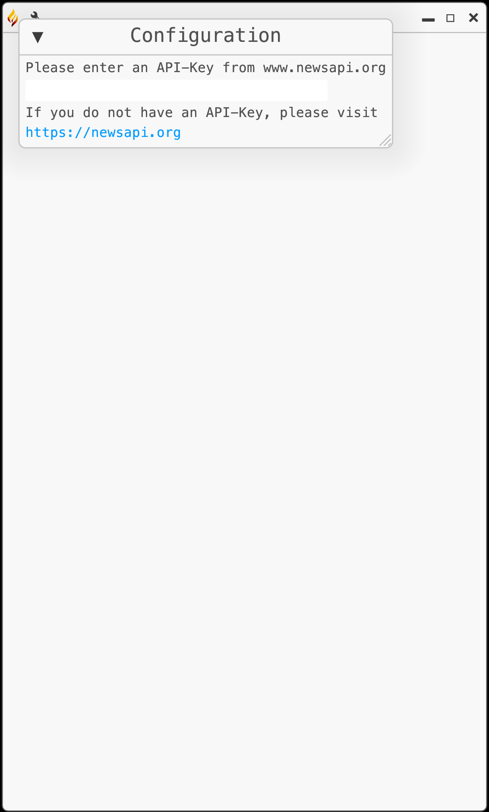
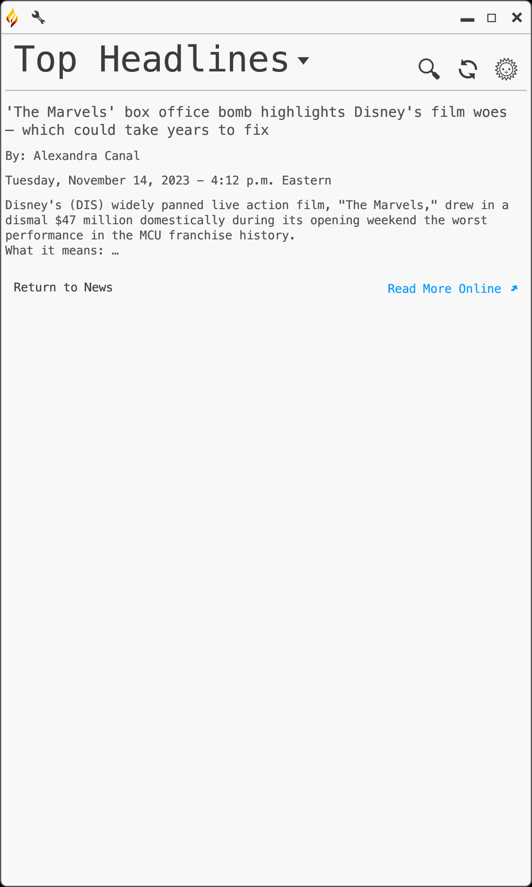

#  Prometheus


---
Student: Ricardo Harris

Degree: Bachelor of Science in Computer Science

Project Advisor: Dr. Sean Hayes

Expected Graduation: December 2023

---

<table>
	<thead>
		<tr>
			<th align="left">
				Table of Contents:
			</th>
		</tr>
	</thead>
	<tbody>
		<tr>
			<td>
				1. <a href="#desc">Project Implementation</a></br>
			</td>
		</tr>
	</tbody>
</table>

---
## Project Implementation<a id="desc"></a>

&nbsp;&nbsp;&nbsp;&nbsp;&nbsp;This project is a full development cycle of a newsreader application from development in Rust to deployment through a React application. The Prometheus application is a standalone GUI built using the Rust Eframe framework, built to display information as requested from https://newsapi.org/. News can be requested by topic or by custom searches. These results are sorted by most engagement by country, which is set by the user. Lastly, the user can customize their viewing experience through modifying the font size and through toggling night mode. The React application serves as a website for the distribution of the Prometheus application, including a description of the product, download links for the product by Operating System, installation instructions, and operational instructions.
The React application also links to the compiled Senior Project documentation ([found here](https://github.com/RicoNoSuave/CSU_Senior_Project/blob/master/docs/Prometheus%20Full%20Documentation.md)).

### How to compile and run the program

&nbsp;&nbsp;&nbsp;&nbsp;&nbsp;To compile this project, it will require several pre-existing conditions. First, <a href="https://www.rust-lang.org/tools/install">install Rust</a>, 
<a href="https://docs.npmjs.com/downloading-and-installing-node-js-and-npm">NPM, and Node</a>. To compile the Prometheus newsreader application, download the Prometheus/ file from src, then run:
```
cargo run;
```
To run the web application, create a react project using:
```
npx create-react-app <project name>;
```
Install react-router-dom in your project by:
```
cd <project name>;
npm install react-router-dom;
```
Then copy the prometheus_website/public/ and prometheus_website/src/ files from the src folder to your react application. Lastly, run:
```
npm start;
```
To publish your copy of the web application to your default port. Navigate to localhost:xxxx and enjoy!


### UI Design

&nbsp;&nbsp;&nbsp;&nbsp;&nbsp;As there are two products to this project, each product has their own UI Design. To begin with the React application, there is a focus on simplicity and theme. The Home page contains a descriptor of Prometheus and an image of it functioning (see Fig 1), while the Download page contains the download links to the project, installation instructions, and useage instructions with pictures (see Fig 2 and 3).

<br /> Fig 1. The Homepage of the Web Application.

<br />Fig 2. The Download page.
 
<br />Fig 3. Useage instructions on the Download page.

When using the Prometheus Application for the first time, you need to have an API Key from https://newsapi.org/ (see Fig 4).

<br />Fig 4. The launch screen before entering an API Key.

&nbsp;&nbsp;&nbsp;&nbsp;&nbsp;Once you have an API entered, you will have access to the full application (see Fig 5). When using Prometheus, you can change topics (see Fig 6), access articles (see Fig 7), and search for specific articles (see Fig 8).

<br />Fig 5. Prometheus running as normal.

<br />Fig 6. Changing news topics.

<br />Fig 7. A rendered article.

<br />Fig 8. Search screen.

&nbsp;&nbsp;&nbsp;&nbsp;&nbsp;By clicking the settings button in the top right (see Fig 9), you can change to the top news in a different country (see Fig 10), change the text size (see Fig 11), and link back to the Homepage. Lastly, to invert the color scheme, click the night-mode button on the right (see Fig 12).

<br />Fig 9. Settings.
 
<br />Fig 10. Choose your country.
 
<br />Fig 11. Choose your text size.

<br />Fig 12. Night mode.

### Additional Considerations

To use the Prometheus application, you will need an API key from https://newsapi.org/.
